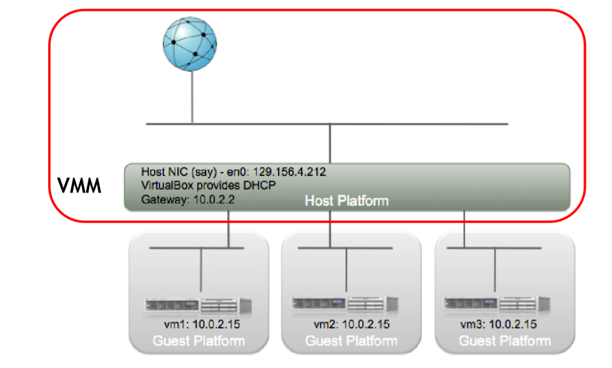
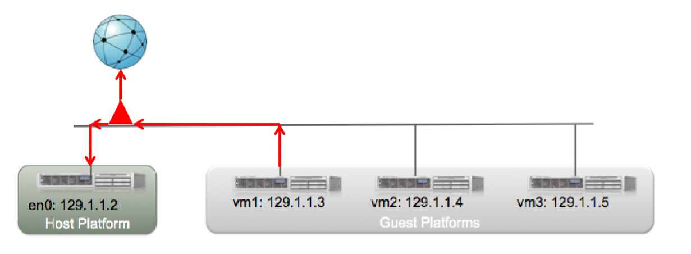
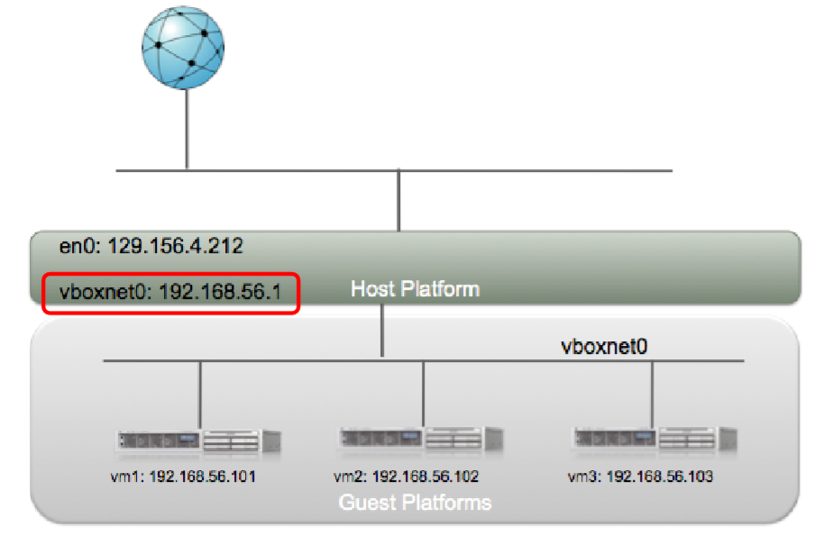

# Storage and Disks

### HDD Structure

$$
LBA=(C\cdot heads \ per \ cylinder \ + \ H)\cdot \ sector \ per \ track \ + \ (S-1)
$$

$$
C=\frac{LBA}{head \ per \ cylinder \cdot \ sector \ per \ track}
$$

$$
H=\frac{LBA}{sector \ per \ track} \ (mod \ head \ per \ cylinder)
$$
**Response Time**

The response time is the sum of the time spent in the queue waiting and of the service time, which is the time effectively spent to read the data. We will evaluate only the latter, which is the sum of • Seek time: head movement time; • Rotational latency: the time to wait for the sector, which is assumed to be half a round; • Data transfer time: a function of the rotation speed, the storing density and the cylinder position; • Controller overhead: the time required to send the data.   Another quantity to consider is the data locality, which considers the fragmentation of the disk by telling the percentage of data that are stored contiguously. 

<u>Single Block Response Time</u>
$$
service \ time = (1-locality)\cdot(seek \ time + rot \ latency)\  +trans \ time \ + \ contr \ overhead
$$

<u>Multiple Blocks Response Time</u>
$$
total= affected\cdot(1-locality)\cdot (tr +contr+seek+lat)+unaffected\cdot locality\cdot(tr+contr)
$$

### SSD Structure

Data are stored in an array of NAND cells, which can be of two types:

- Single layer, that store only one bit

- Multiple layer, that store more than one (typically two) bit by multilevel voltage, they have a higher capacity but a smaller data reliability.  

  

 A page can be in three states:

- Empty: it is possible to write only on them
- Dirty: the content has been marked as "can be deleted", but it has not been deleted yet
- In use: it is meaningful to read them. 

# Virtualization

## Virtual Network Adapters

There are 4 kinds of VNA:

- Network Address Translation (NAT)
- Bridged Networking
- Host Networking
- Internal Networking

**NAT**

- Each VM has a different Private Virtual Network that connects it just to the host OS
- The VMM is treated as any other application.
- port-forwarding must be enabled

**Bridged Networking**

- the VM seems to be actually connected to the real network
- no port-forwarding should be setup

**Host-only Networking**

- VMs are not directly connected to the external network
- Allows the connection between the Host and the Guest VMs only
- the host and the VMs can communicate among each other using this special virtual network card

**Internal Networking**

- Creates a network that connects only the VMs, and it is not reachable from the outside

# Performance

### Basics

### Unbalanced Systems

### **Open Models**

- ${X_k(\lambda)=\lambda V_k}$

### **Closed Models - batch workload**

- **Performance Bounds**  
  $$
  \frac{1}{D}\le X(N)\le min(\frac{N}{D},\frac{1}{D_{max}})
  $$

  $$
  max(D,ND_{max}) \le R(N) \le ND
  $$

  $$
  N^*=\frac{D}{D_{max}}
  $$

- **Balanced System Bounds**
  $$
  \frac{N}{D+(N-1)D_{max}} \le X(N) \le min(\frac{1}{D_{max}},\frac{N}{D+(N-1)D_{avg}})
  $$

  $$
  max(ND_{max},D+(N-1)D_{avg}) \le R(N) \le D+(N-1)D_{max}
  $$

  
  $$
  N^+=\frac{D-D_{avg}}{D_{max}-D_{avg}}
  $$
  The throughput must be computed, the response time is bounded by lines passing through ${(1,D)}$ and  ${(0,D-D_{avg})(0,D-D_{max})}$ 

### Closed Models - Terminal workloads

**Performance Bounds**  
$$
\frac{N}{D+Z} \le X(N) \le min(\frac{N}{D+Z},\frac{1}{D_{max}})
$$

$$
max(D,ND_{max}-Z) \le R(N) \le ND
$$

$$
N^*=\frac{D+Z}{D_{max}}
$$

**Balanced Systems Bounds**
$$
\frac{N}{D+Z+\frac{(N-1)D_{max}}{1+\frac{Z}{ND}}} \le X(N) \le min(\frac{1}{D_{max}},\frac{N}{D+Z+\frac{(N-1)D_{avg}}{1+\frac{Z}{D}}})
$$

$$
max(ND_{max}-Z,D+\frac{(N-1)D_{avg}}{1+\frac{Z}{D}}) \le R(N) \le D +\frac{(N-1)D_{max}}{1+\frac{Z}{ND}}
$$

$$
N^+=\frac{(D+Z)^2-D\cdot D_{avg}}{(D+Z)D_{max}-D \cdot D_{avg}}
$$

The throughput and the pessimistic bound on response time must be computed. The optimistic bound on the response time is a line through the points ${(0,D-\frac{D_{avg}}{1+\frac{Z}{D}})}$ and ${(1,D)}$.  

### Single-Class Multi Station System with two stations

- ${R_1=r_1V_1}$
- ${R_2=r_2V_2}$
- ${R=R_1+R_2}$