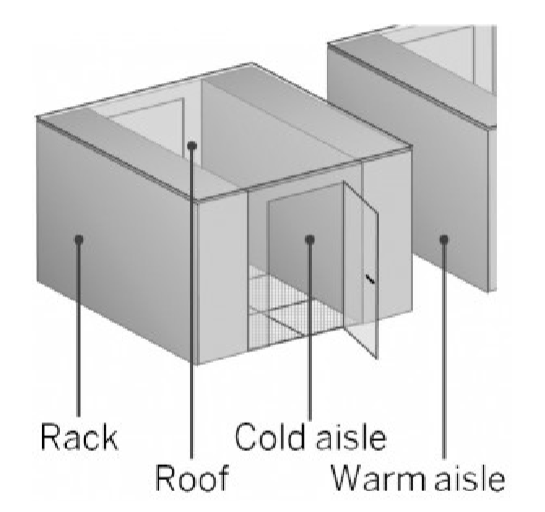
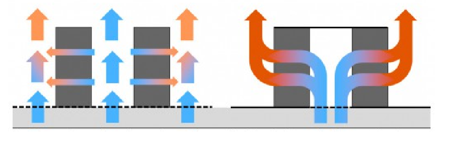
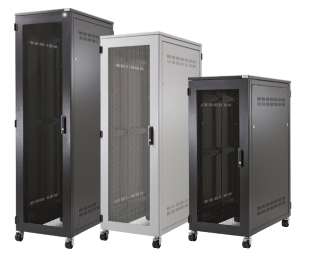
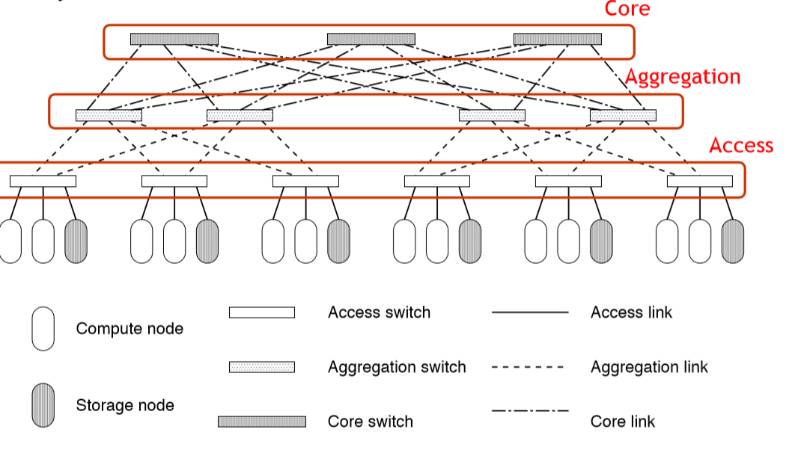
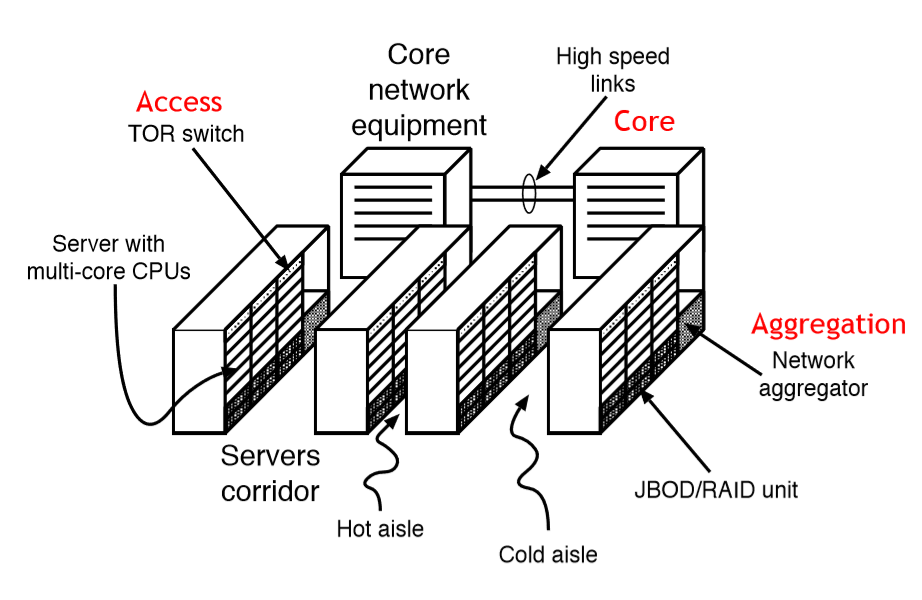
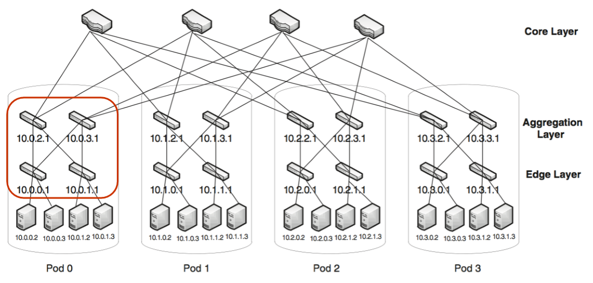
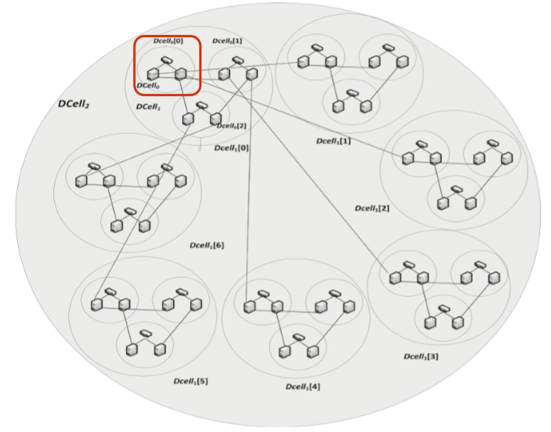

# Notes of Computing Infrastructures

*A series of overly incomprehensible notes of the course Computing Infrastructures as taught in PoliMi.*

[TOC]

# Data Centers

## Data Center Architecture

The IT equipment is stored into corridors, and organized into racks. We will return on this later.

IT equipment generates a lot of heat: the cooling system is usually a very expensive component of the datacenter, and it is composed by coolers, heat-exchangers and cold water tanks.

In order to protect against power failure, battery and diesel generators are used to backup the external supply.

## Data Center Corridors

Corridors where servers are located are split into cold aisle, where the front panels of the equipment is reachable, and warm aisle, where the back connections are located.

Cold air flows from the front (cool aisle), cools down the equipment, and leave the room from the back (warm aisle).

## Data Center Racks

Racks are special shelves that accommodate all the IT equipment and allow their interconnection. 

IT equipment must conform to specific sizes to fit into the rack shelves.

**Rack Modules**

Four types of equipment are usually present into racks:

- Servers
- Communication Equipment
- Storage Units
- Power Distribution Units

### Servers

They are the main processing equipment.

They are like ordinary PC, but with a form factor that allows to fit them into the racks.

They may differ in:

- Number and type of CPUs
- Available RAM
- Locally attached disks (HDD, SSD or not installed)
- Other special purpose devices (like GPUs, DSPs and coprocessors)

### Communication Equipment

They allows network interconnections among the devices.

They can be:

- Hubs
- Routers
- DNS or DHCP servers
- Load balancers
- Technology switches
- Firewalls 

### Storage Units

Storage units holds large amount of data.

They are:

- JBOD (Just a Bunch Of Disks)
- RAID controllers
- NAS heads

They can use:

- HDD
- SSD
- Ram disks

### Power Distribution Units

Power Distribution Units (PDUs) are the last type of devices that can be fit into racks.

They are usually not consider as IT equipment, but they consume rack units.
The distribute the energy to the devices inside the rack.
They can provide additional feature such as energy consumption monitoring and remote turn on/off.

## Data Center Network Architectures

It has been proven that in most data-centers what really limits the performances of the infrastructure is the network.
Several different configurations have been tested. The most important are:

- Three layers

- Fat-tree
- D-Cell

### Three Layers

Three layer architecture configures the network in three different layers:

- Core
- Aggregation
- Access

Three layer architecture reflects the topology of the data center: 

#### Access

Switches at the access layer can be put into two positions:

- *Top-Of-the-Rack (TOR):*  
  Access switches are put at the top of each rack. The number of cables is limited. The number of ports per switch is also limited (lower costs). However the scalability is also limited.
- *End-Of-the-Line (EOL):*  
  Switches are positioned one per corridor, at the end of a line of rack. Switches must have a larger number of ports, and longer cables are required (higher costs). However the system can scale to have a larger number of machines.

Bandwidth can be increased by increasing the switches at the core and aggregation layers, and by using routing protocols such as Equal Cost Multiple Path (ECMP) that equally shares the traffic among different routes.

This solution is very simple, but can be very expensive in large data-centers since:

- Upper layers require faster network equipments. For example:
  - 1 GB Ethernet at the access layer
  - 10 GB Ethernet at the aggregation layer
  - 25 GB Optical connections at the core layer
- The cost in term of acquisition and energy consumption can be very high.

### Fat-Tree

Fat-tree topologies use a larger number of slower speed switches and connections. In particular, nodes are divided into pods characterized by the same number of nodes and switches.

In every pods, switches are divided into two layers, and they are connected to half of the nodes (or half of the lower layer switches).

There is a division in 

- Core Layers
- Aggregation Layers
- Edge Layer

### D-Cell

D-Cell topology, defines the network in recursive way. Cells are organized in levels. Switches connects nodes at the lower level.

### Comparison between 3L-FT-DC

**FT over 3L**  
The advantage of Fat-tree over three layer, is that it only uses slower switches, which are much less expensive than the one required at the aggregation or core layers.

**3L over FT**  
Fat-Tree's limit is that it requires a high number of switches and cables.

**DC over FT**  
The advantage of DCell is that it requires fewer switches and less cables than the Fat-tree. 

**FT over DC**  
However, some nodes of DC must be configured as router: this can limit their performance, introduce network administration problems, and requires special routing protocols that are not fully standardized yet, this does not happen in FT.

# Virtualization

The main contribution of a VMM is handling virtual resources:  
it presents to the guest OS the interface of a real resource and understands the OS requests and emulates them.    

Virtualization maps virtual resources to a set of managed ones, which are often physical and in rare cases are virtual, it can provide

1. The same interface (virtualization):  
   *Advantage:*   
   quality of performances improves.  
   *Disadvantage:*   
   it is not always possible

2. A different interface (emulation):  
   *Advantage:*   
   compatibility, interoperability and flexibility 
   *Disadvantage:*   
   lower performances.

   

**Physical Into Virtual Resources Mapping** (three ways)

- *One to one*

- *One to many* 
  Sharing, the main benefits are isolation, flexibility and resource management, it can be implemented using time or space multiplexing

- *Many to one*  
  Aggregation, the main benefits are scalability, reliability and simplification   

  

### CPU   

The host must be able to execute the guest instruction, via emulation if there is a different ISA which prevents direct native execution   

Usually, a core is shared among any virtual machines by partitioning it; 

it should be avoided to assign each machine a number of virtual cores that is greater than the total number of cores of the physical device, as the only way in which it can be implemented time sharing a code and it leads to bad performances. 

However, when more than one virtual machine is running, the total amount of their core can be greater than the physical one, as usually the machines are in a waiting state and therefore the cores are sufficient to execute something on one machine at a time.   

It is also possible to set an execution cap, that is the maximum amount of time a core can be used by a machine, it allows to select less important machines and ensure they don’t interfere with the execution on the most important ones.   

### Memory   

The sum of the memory allocated for each machine should be less than the total physical memory, but it can lead to a poor utilization of the real memory. So, it is preferred to assign memories that, if summed, result greater than the physical one.  

Allocating new memory can be done in two ways:

- *Memory ballooning:*  
  the VMM asks the host for the list of free pages when it needs more memory.  
  it is possible only when the VMM is aware to be virtual (para virtualization)
- *Overcommit:*   
  the VMM rewrites the pages it supposes to be less used, it happens when it is not aware to be virtual and so it believes to have the entire memory available 

Conventional operative systems virtualize memory since they load only a few pages into the RAM and, if another page is needed, one of those in the RAM is put back into the disk and then another one is loaded. 

With virtualization, another saga structure is needed, it is called memory *management unit (MMU)* and it allows to separate the process address space from the physical one. For each virtual page, it contains the physical address and three flags that tell whether or not the page is loaded into memory, whether or not it has been changed and whether or not it is free.   Each virtual machine has its own virtual memory, so it is necessary to maintain synchronization and consistency among them. It can be done in two ways. 

**Virtual resources** 

1. *Shadow pages*  
   which are maintained by the VMM and consist of the mapping of the virtual pages of the guest into the physical ones of the host, they are used by the hardware to translate the addresses and they are synchronized with the host’s page table by the VMM.  
   The counter effect is a lot of overhead when they are updated

2. *Nested pages*  
   which remove the overhead in translating but require a hardware that is able to support it.  
   The translation lookaside buffer is able to cache the translation to make it faster. 

   

### I/O devices   

The VMM builds a virtual version of the devices, it intercepts and handles the requests.  
Devices can be dedicated (keyboard, mouse, …), partitioned (large disks) or shared (network adapter)  .

### Virtual disks   

They can convert the entire HDD into a file.

there are two types

- Fixed size format creates a file that has the dimension of the entire HDD
- Variable size format starts with a reduced size and can grow up to the whole size of the disk, it stores only the used blocks.

Both of them allow the user to create snapshots, which consist of saving the content of the disk to allow to return to it if needed.   
The first one is really saved, for the followings only the differences with the previous one are stored.

### Network Virtualization   

There are 4 kinds of Virtual Network Adapters (VNA):

- Network Address Translation (NAT)
- Bridged Networking
- Host Networking
- Internal Networking

#### NAT

- Each VM has a different Private Virtual Network that connects it just to the host OS
- The VMM is treated as any other application.
- port-forwarding must be enabled

#### Bridged Networking

- the VM seems to be actually connected to the real network
- no port-forwarding should be setup

#### Host-only Networking

- VMs are not directly connected to the external network
- Allows the connection between the Host and the Guest VMs only
- the host and the VMs can communicate among each other using this special virtual network card

#### Internal Networking

- Creates a network that connects only the VMs, and it is not reachable from the outside

# Performance

### Basics

### Unbalanced Systems

### Open Models

- $X_k(\lambda)=\lambda V_k$

### Closed Models - batch workload

- **Performance Bounds**  
  $$
  \frac{1}{D}\le X(N)\le min(\frac{N}{D},\frac{1}{D_{max}})
  $$

  $$
  max(D,ND_{max}) \le R(N) \le ND
  $$

  $$
  N^*=\frac{D}{D_{max}}
  $$

- **Balanced System Bounds**
  $$
  \frac{N}{D+(N-1)D_{max}} \le X(N) \le min(\frac{1}{D_{max}},\frac{N}{D+(N-1)D_{avg}})
  $$

  $$
  max(ND_{max},D+(N-1)D_{avg}) \le R(N) \le D+(N-1)D_{max}
  $$

  $$
  N^+=\frac{D-D_{avg}}{D_{max}-D_{avg}}
  $$

  The throughput must be computed, the response time is bounded by lines passing through ${(1,D)}$ and  ${(0,D-D_{avg})(0,D-D_{max})}$ 

### Closed Models - Terminal workloads

**Performance Bounds**  
$$
\frac{N}{D+Z} \le X(N) \le min(\frac{N}{D+Z},\frac{1}{D_{max}})
$$

$$
max(D,ND_{max}-Z) \le R(N) \le ND
$$

$$
N^*=\frac{D+Z}{D_{max}}
$$

**Balanced Systems Bounds**
$$
\frac{N}{D+Z+\frac{(N-1)D_{max}}{1+\frac{Z}{ND}}} \le X(N) \le min(\frac{1}{D_{max}},\frac{N}{D+Z+\frac{(N-1)D_{avg}}{1+\frac{Z}{D}}})
$$

$$
max(ND_{max}-Z,D+\frac{(N-1)D_{avg}}{1+\frac{Z}{D}}) \le R(N) \le D +\frac{(N-1)D_{max}}{1+\frac{Z}{ND}}
$$

$$
N^+=\frac{(D+Z)^2-D\cdot D_{avg}}{(D+Z)D_{max}-D \cdot D_{avg}}
$$

The throughput and the pessimistic bound on response time must be computed. The optimistic bound on the response time is a line through the points ${(0,D-\frac{D_{avg}}{1+\frac{Z}{D}})}$ and ${(1,D)}$.  

### Things

in interactive systems we can't use little's law because we have thinking users.

- Workload Intensity: the rate at which customers arrive
- Service Demand: Average service requirement of a customer
- Utilization: the proportion of time the server is busy
- Residence Time: the average time spent at the service center by a customer, both queueing and receiving service
- Response Time:the intuitive notion of perceived system response time
- Queue Length: the average number of customers at the service center, both waiting and receiving service
- Throughput: the rate at which customers pass through the service center

### Single-Class Multi Station System with two stations

- ${R_1=r_1V_1}$
- ${R_2=r_2V_2}$
- ${R=R_1+R_2}$

# Storage

## RAIDS

The aim is to emulate a very expensive disks buying a bunch of less expensive ones: to increase the performance, the size and the reliability of storage systems, several independent disks are considered as a single one. Data are striped across the disk and accessed in parallel, thus gaining high parallelism in accessing them and load balancing.     
Two techniques must be implemented on RAID disks.

- ***Data striping:***  
  data are written sequentially according to a cyclic algorithm (round robin), it allows reading and writing in parallel
- Stripe unit:  
    the amount of data written on a single disk
  - Stripe width:  
    the number of disks considered by the algorithm, which can be less than the total amount of disks. 
  
- ***Redundancy:***  
  it is necessary as the probability of failure rises with the growing of the number of disks, it consists of error-correcting codes, that are stored on different disks than the data and can be used to reconstruct the data after a failure; the main drawback is the slowing down of the writing operations, as these values must be computed and stored along with the data.   

There are many types of architectures, the choice should be done accordingly to the required features.   

### RAID 0  

Data are written on a single logical disk and then split by the controller among the several physical disks.   
It has the lowest costs and the best write performance of all the levels, but the failure of a single disk will cause the loss of data, so it is used where performance and capacity are very important while data reliability is not an issue.   

$$
MTTDL=\frac{MTTF}{n}
$$

### RAID 1 

Data are duplicated, two physical disks contain the same data;   
it has a high reliability, and read and write performance are not bad, as data can be accessed in parallel without the need of computing parity bits;  
the main drawback is the cost, as only 50% of the capacity can be used.   
In theory, data could be copied on more than one disk, but this solution is never used due to the prohibited costs.  

$$
MTTDL=\frac{MTTF^{(n)}}{n \cdot MTTR^{(n-1)}}
$$
### Combinations of 0 and 1

If several disks are available, RAIDs can be combined:  
x+y means that there are ${n\cdot m}$ disks in total, then RAID ${x}$ is applied to groups of ${n}$ disks, that are treated like a single one onto which is applied RAID ${y}$.  
Two very used configurations are ${0+1}$ and ${1+0}$, the former places redundancy at a higher level, thus becoming less fault tolerant as there are only two groups of RAID1:  
if two disks on different groups fail, the controller cannot realize that their copies could still be found on the other RAID0 level and so data are lost. Performances and storage capacity are the same.    

***Raid 0 + 1***

$$
MTTDL=2\cdot \frac{MTTF^2}{n^2\cdot MTTR}
$$

***Raid 1 + 0***  

$$
MTTDL=\frac{MTTF^2}{n\cdot MTTR}
$$

### RAID 2 

It's not used.  
The number of redundant disks is proportional to the log of the total number of disks.  
The parity is calculated for several subset of overlapped data, the number of disks where parity bits are stored is proportional to the logarithm of the disks that contain data. When a block fails, several of the parity blocks will have inconsistent value, the failed component is the one held in common by each incorrect subset.  

### RAID 3 

Here the failed disk is assumed to be known, which is realistic as the controller is usually able to detect the failed component.  
Data are interleaved byte-wise over the data disks.  
There is a single disk to store parity bits, while all the others contain data, meaning that only one request can be served at a time.  

${Byte \space Parity =byte_0 \ XOR \ byte_1 \ XOR \ byte_2 \ byte_3}$

Having the following 3 bytes:

${a) \ 01100011 \ XOR}$  
${b) \ 10101010 \ XOR}$  
${c) \ 11001010=}$  
${p) \ 00000011}$  

Suppose losing ${a)}$. We can reconstruct it:  

${p) \ 00000011 \ XOR }$
${b) \ 10101010 \ XOR}$  
${c) \ 11001010=}$  
${a) \ 01100011 }$

### RAID 4 

It is similar to level 3, the main difference is that <u>parity is calculated for strips that have the same position in all the disks and then stored in that aimed for redundancy.</u>   
The single disk for redundant data (parity disk, accessed at each write) can easily become the bottleneck: all the write must access it, so they cannot be parallelized. This level is able to recover from the failure of one disk.   

### RAID 5 

It is exactly identical to level 4, but the parity blocks are uniformly distributed over the disk, thus avoiding the bottleneck on the parity disk and allowing load balancing among the data disks.  
It loses data if more than one disk fails.  

$$
MTTDL=\frac{MTTF^2}{(n)(n-1)MTTR}
$$

### RAID 6 

This level is able to recover from the failure of two disks, as it uses two redundancy schemes P and Q which are independent.  
On the other hand, it needs a disk more than level 5 to be implemented and a greater computational overhead, so it must be used only for very critical applications.   

However, its efficiency grows with the number of disks, as does the probability of having two failures. 

Legenda:  

- ${D_i = }$ the ${i}$-th data block ${(i=0...n-1)}$ 
- ${P=}$ Parity Value number 1
- ${Q=}$ Parity Value number 2
- ${g=}$ a generator value (a constant) needed to compute ${Q}$ . 
- ${n=}$ the number of blocks of a disk reserved to store data 

The two parity values are computed as follows:  

$$
P=\sum_{i=0}^{n-1}D_i
$$

$$
Q=\sum_{i=0}^{n-1}g^iD_i\ \ \ \ \  g \neq 1
$$
​    
The repairing technique depends on which disk (or disks) have failed: 

1. <u>*A data disk:*</u>  
   ${D_i=P-\sum_{j=0,j\neq i}^{n-1}D_j}$   

2. *<u>A parity bit:</u>*  
   simply recompute it, data are still available  

3. *<u>A data disk and the Q block:</u>*  
   the data are reconstructed as  
   ${D_i=P-\sum_{j=0,j\neq i}^{n-1}D_j}$ and then used to recompute ${Q}$  

4. *<u>A data disk and the ${P}$ block:</u>*  
   data are reconstructed as 
   $$
   D_i=\frac{(Q-\sum_{j=0,j \neq i}^{n-1}g^jD_j)}{g^i}  
   and then used to reconstruct P
   $$

   and then used to reconstruct P  

5. *<u>Two data disks ${D_i}$ and ${D_j}$:</u>*   
   a system of equation must be solved, calling 
   $$
   P^*=\sum_{k=0,k\neq i, k \neq j}^{n-1}D_k
   $$
   
   $$
   Q^*=\sum_{i=0,k\neq i,k\neq j}^{n-1}g^kD_k
   $$
   

   the values of the parity bits computed without the broken disks, the two equations are  
   
   $$
   \begin{cases}P=P^*+D_i+D_j \\Q=Q^*+g^i D_i+g^j D_j \end{cases}
   $$
   

   With a few data blocks, the system above is very easy to compute by hand, otherwise, an efficient way of solving such system of equations is to precompute two coefficients and use them to recover ${D_i}$ and ${D_j}$.    
   
   $$
   A_{ij}=-\frac{g^{j-i}}{1-g^{j-i}}
   $$

   $$
   B_{ij}=-\frac{g^{-i}}{1-g^{j-i}}
   $$

   and then:    

$$
   D_i=A_{ij}(P-P^*)+B_{ij}(Q-Q^*)
$$

$$
   D_j=P-P^*-D_i
$$

However, these techniques work only for machines with infinite precision, that do not exist. The solution is to use a special algebra, called Galois Fields, that includes only the integer powers of prime numbers and allows to perform all the previous mentioned operations using numbers that can fit into a byte.

$$
MTTDL=\frac{2MTTF^3}{(n)(n-1)(n-2)MTTR^2}
$$

### RAID 7

not standardized yet, we will not see it.

## Storage systems 

There are three main types of storage systems   

1. ***Direct Attached Storage (DAS)***   
   It is a system directly attached to a server or a workstation, it has a limited scalability, a complex management and low performances and it is difficult to read files on other machines. It can be an internal drive as well as an external disk, connected with a "point to point" network.

2. ***Network Attached Storage (NAS)***   
   A NAS unit is a computer connected to a network that provides only file-based storage to other services in the network, it has its own IP address and the system is very scalable. It is designed as a self-contained solution to share files over the network, so its performance depends mainly on its speed and congestion. It is used for low-volume access to a large amount of storage by many users.

3. ***Storage Area Network (SAN)***   
   They are remote storage units that are connected to the PC with a specific network technology, it does not provide the file system and it is seen by the operative system simply as a disk, differently than NAS that is visible as a server. It is used for petabytes of storage and multiple, simultaneous access to files (Netflix), it is highly scalable. 

   

## Fiber Channel Interface

As said, a special interface is needed to access it:  
The TCP/IP stack over ethernet leads to many issues, that is not needed for the specific purpose, so a specific protocol called *fiber channel* is implemented.  
It is a high-speed network technology that is well established in the open system environment.  
They are accessed using the standard ethernet using an appliance called NAS 

# Storage Structures

## HDD Structure

$$
LBA=(C\cdot heads \ per \ cylinder \ + \ H)\cdot \ sector \ per \ track \ + \ (S-1)
$$

$$
C=\frac{LBA}{head \ per \ cylinder \cdot \ sector \ per \ track}
$$

$$
H=\frac{LBA}{sector \ per \ track} \ (mod \ head \ per \ cylinder)
$$

#### Definitions

- *Response time:*  
  The sum of the *time spent in the queue waiting* and of the *service time*, which is the time effectively spent to read the data.  
  We will evaluate only the latter, which is the sum of

- *Seek time:*  
  head movement time
- *Rotational latency:*  
  the time to wait for the sector, which is assumed to be half a round
- *Data transfer time:*  
  a function of the rotation speed, the storing density and the cylinder position
- *Controller overhead:*  
  the time required to send the data.   

#### Without Locality

- **Rotational Latency of a disk**  
  The rotational latency of a disk is half of the time required to perform one rotation  
  $$
  T_{rotational \ latency}=\frac{1}{2 \cdot rs}
  $$
  where ${rs}$ is the rotation speed expressed in ${ms}$ 

- **Transfer Time**
  $$
  transfer \ time = \frac{sector \ to \ be \ transfered}{data \ transfer \ rate }
  $$

- **Total I/O Service Time**   
  $$
  T_{I/O}=T_{controller \ overhead}+T_{average \ seek \ time} + T_{rotational \ latency}+ \ transfer \ time
  $$

#### With Locality

Another quantity to consider is the data locality, which considers the fragmentation of the disk by telling the percentage of data that are stored contiguously. 

<u>Single Block Response Time</u>
$$
service \ time = (1-locality)\cdot(seek \ time + rot \ latency)\  +trans \ time \ + \ contr \ overhead
$$
<u>Multiple Blocks Response Time</u>
$$
total= affected\cdot(1-locality)\cdot (tr +contr+seek+lat)+unaffected\cdot locality\cdot(tr+contr)
$$

## SSD Structure

Data are stored in an array of NAND cells, which can be of two types:

- Single layer, that store only one bit

- Multiple layer, that store more than one (typically two) bit by multilevel voltage, they have a higher capacity but a smaller data reliability.  

  

 A page can be in three states:

- *Empty:*  
  it is possible to write only on them
- *Dirty:*  
  the content has been marked as "can be deleted", but it has not been deleted yet
- *In Use:*   
  it is meaningful to read them. 

# Childhood's Memories

- ${RPM=}$ Revolutions Per Minute